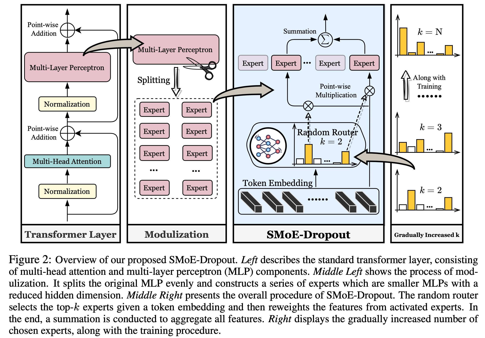

# Sparse MoE as the New Dropout: Scaling Dense and Self-Slimmable Transformers

[](https://opensource.org/licenses/MIT)

Code for this paper [Sparse MoE as the New Dropout: Scaling Dense and Self-Slimmable Transformers](https://openreview.net/forum?id=w1hwFUb_81)

Tianlong Chen\*, Zhenyu Zhang\*, Ajay Jaiswal, Shiwei Liu, Zhangyang Wang

Our implementation is based on [fastmoe repo](https://github.com/laekov/fastmoe) and [huggingface repo](https://github.com/huggingface/transformers). More training script and pre-trained models are coming soon.


## Overview

Despite their remarkable achievement, gigantic transformers encounter significant drawbacks, including exorbitant computational and memory footprints during training, as well as severe collapse evidenced by a high degree of parameter redundancy. Sparsely-activated Mixture-of-Experts (SMoEs) have shown promise to mitigate the issue of training efficiency, yet they are prone to (1) redundant experts, due to representational collapse; and (2) poor expert scalability for inference and downstream fine-tuning, primarily due to overfitting of the learned routing policy to the number of activated experts during training. As recent research efforts are predominantly focused on improving routing policies to encourage expert specializations, this work focuses on exploring the overlooked scalability bottleneck of SMoEs and leveraging it to effectively scale dense transformers. To this end, we propose a new plug-and-play training framework, SMoE-Dropout, to enable scaling transformers to better accuracy in their full capacity without collapse. Specifically, SMoE-Dropout consists of a randomly initialized and fixed router network to activate experts and gradually increases the activated expert number as training progresses over time. Transformers trained by SMoE-Dropout naturally exhibit a self-slimmable property subject to resource availability, offering smooth and consistent performance boosts with an increase in activated experts during inference or fine-tuning. The framework of our SMoE-Dropout is demonstrated in the following figure.




## Prerequisite

- pytorch
- fastmoe: https://github.com/laekov/fastmoe
- transformer: https://github.com/huggingface/transformers

## Usage

##### Pretraining Transformer-XL on enwik8: 

``` # Table 1: 
bash script/table1/smoe_dropout.sh
bash script/table1/directly_dense_training.sh
```

##### Transfor pretrained model on SST-2:

```
bash script/table2/sst2/dense_model.sh [pretrained-checkpoint]
bash script/table2/sst2/smoe_dropout.sh [pretrained-checkpoint]
```

##### Ablation:

```
bash script/figure5/8layers_smoe_dropout.sh
bash script/figure5/12layers_smoe_dropout.sh
```

## Citation

```
@inproceedings{
  chen2023sparse,
  title={Sparse MoE as the New Dropout: Scaling Dense and Self-Slimmable Transformers},
  author={Tianlong Chen and Zhenyu Zhang and AJAY KUMAR JAISWAL and Shiwei Liu and Zhangyang Wang},
  booktitle={The Eleventh International Conference on Learning Representations },
  year={2023},
  url={https://openreview.net/forum?id=w1hwFUb_81}
}
```

